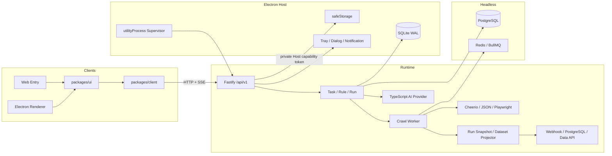
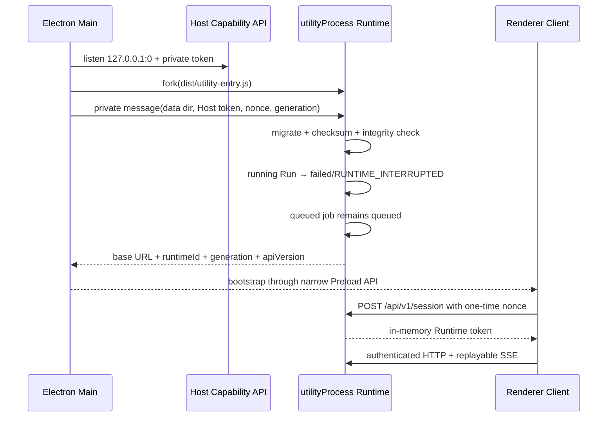

# ZhiYun Architecture

> 本文描述当前已经实现的 Level 1 Client / Runtime / Host 架构。
>
> 下一阶段的大重构目标、TS/Python 分工、数据分析与语料库架构见
> [ZhiYun Level 2 TS/Python 大重构架构方案](./architecture/ZHIYUN_LEVEL2_TS_PYTHON_REFACTOR.md)。

## Level 1 Client / Runtime / Host

`buildRuntime()` 只接收 `Repository`、`QueueAdapter`、`SchedulerAdapter`、`CrawlerService`、`AiProvider`、`CredentialStore`、`ArtifactStore` 和 `HostCapabilities`。它不创建全局 PostgreSQL、Redis、BullMQ、SQLite 或 Electron 对象。

## Desktop 启动与恢复

Runtime 异常退出时 Main 使用 1/2/4/8 秒退避重启；10 分钟最多五次。generation 改变时 Client 中止旧请求、清空 ETag cache、结束旧 SSE 并重新协商。正在执行的 Run 不自动重跑，恢复为 `failed` 和 `RUNTIME_INTERRUPTED`；排队任务继续执行。

## 数据一致性

- PostgreSQL 和 SQLite 实现同一个 Repository contract。
- SQLite 启用 WAL、foreign keys、5 秒 busy timeout 和单 authoritative writer。
- `runs(task_id)` 对 queued/running 建立部分唯一索引，阻止同任务重叠。
- Task/Run 状态与 Domain Event 在同一个数据库事务提交。
- Run Records 保持不可变；Dataset 使用 Snapshot、Upsert 或 Append 投影，只为 Added/Updated/Removed 建立变更记录。
- Dataset 使用 `(last_seen_at,id)` keyset cursor，避免大数据翻页的 offset 退化。
- SQLite migration 为 forward-only，保存 SHA-256 checksum；升级前备份，启动后执行 integrity check。
- Redis/BullMQ 只承载 Headless 队列、Cron 和锁，最终状态始终在 Repository。

## HTTP 协议

- 唯一业务前缀为 `/api/v1`，旧 `/api` 路由返回 RFC 7807 404。
- `POST task/rule/run/export` 要求 `Idempotency-Key`。
- Task 更新要求 `If-Match`，响应返回 revision ETag。
- 列表使用 cursor；Run 状态通过持久 Domain Event SSE 重放，实时进度使用独立 SSE。
- Desktop session nonce 只能使用一次；Runtime token 只保存在 Renderer 内存。
- Host Capability API 使用独立随机端口和 token，Host token 从不进入 Renderer。

## 安全边界

- Renderer：`nodeIntegration=false`、`contextIsolation=true`、`sandbox=true`、严格 CSP。
- Preload 只暴露 bootstrap 获取与 generation 变更事件。
- 生产资源由 `app://zhiyun` 提供；拒绝 `file://`、任意导航及非 HTTP(S) 外链。
- Desktop 凭据使用 `safeStorage`；不可用时显式失败，不降级为明文。
- Headless 凭据使用 AES-256-GCM；生产强制 `ZHIYUN_CREDENTIAL_KEY`。
- Artifact 保存在 Runtime 控制目录；Desktop Renderer 不读取绝对路径或文件内容。
- URL、重定向和 Browser 子请求经过 DNS/IPv4/IPv6/Metadata/私网策略检查；敏感凭据限定在任务初始 Origin。
- Headless production 使用管理员 Token 换取 12 小时内存 Session；Data API Token 只保存 Hash，并限制任务 Scope。

## 发布

Electron 44.0.0 与 Forge 7.11.2 生成 macOS arm64/x64 DMG + ZIP 和 Windows x64 Squirrel Setup。`better-sqlite3` 由 Forge 针对 Electron ABI rebuild，原生模块由 auto-unpack-natives 放到 ASAR 外；Playwright Chromium 作为 `extraResource` 分发。当前没有 publish 或 autoUpdater。

`bun run desktop:make` 是统一发布入口。安装器构建机需要平台原生编译环境；macOS 的 Forge DMG maker host addon 在制作阶段由 Node/Python toolchain 编译，但这些工具和模块不会成为已安装应用的运行依赖。
