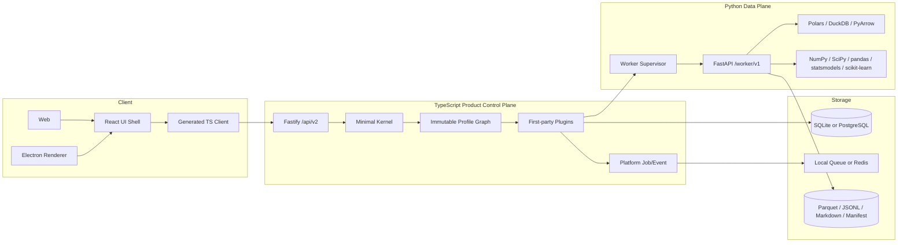

# ZhiYun 1.0 当前架构

本文描述 1.0 实际发布架构。详细设计、技术选型和非目标见 [ZHIYUN_LEVEL2_TS_PYTHON_REFACTOR.md](./architecture/ZHIYUN_LEVEL2_TS_PYTHON_REFACTOR.md)，唯一 owner 清单由 [Architecture Catalog](./generated/architecture-catalog.json) 生成并在 CI 检查 drift。

## 1. 架构形态



架构是 Local-first 模块化单体，不是微服务集合。Worker 与 Runtime 同机，由 Host/Bun Launcher 监督；Worker 失败不阻止 Collection、Dataset 和 Outputs。

## 2. Kernel 与 Profile

Kernel 只负责依赖图、Service Token、贡献 staging、Effect 生命周期和原子发布。固定启动顺序：

```text
Resolve Graph → Validate DAG → Preflight/Apply Migrations
→ Stage Services/Routes/Events/UI → Activate
→ Validate OpenAPI/Catalog → Atomic Publish → Ready
```

Graph 发布后不可修改。Profile 变化要求重启 Runtime。正式 Profile 是：

- `desktop-studio`
- `headless-server`
- `safe`
- `test`
- `e2e`

Legacy Plugin 和 `level2-preview` 已从 1.0 活动 Catalog 删除。所有 timer、SSE、scheduler、queue consumer、inspection browser 与 Supervisor 都必须作为 Effect 逆序关闭。

## 3. Plugin 所有权

```text
platform
└── datasets
    └── collection
        ├── outputs
        ├── preferences
        └── ai-assistance
    ├── analytics
    └── corpus
```

每个 Route、operationId、表、Migration、Event、Job Handler 和 UI Contribution 只有一个 owner。Plugin 不导入其他 Plugin 的 persistence/HTTP 实现，也不跨域直接查询数据库；跨域协作通过 Contract port、持久事件或组合层编排。

`buildLevel2Runtime()` 只完成 Repository/Capability 装配、Handler 注册和 Gateway 初始化。旧全局 Repository、LocalScheduler、SQLite global storage 与 Drizzle migration chain 已从工作区删除。

## 4. Product API 与 Client

- Product API：`/api/v2`
- Worker Protocol：`/worker/v1`
- `/api/v1`：RFC 7807 404
- Mutation：`Idempotency-Key`
- 可更新资源：`ETag` / `If-Match`
- 列表：cursor
- 持久 Domain Event 与 realtime progress 使用独立 SSE/cursor

Runtime 发布的 OpenAPI 由活动 Profile 的 Route Contribution 过滤；Gateway 启动时进行双向校验，禁止未登记路由或无实现贡献。`@zhiyun/client` 与 Worker Client 均由 OpenAPI 生成并执行 drift check。

Runtime generation 改变时 Client 中止旧请求、清空 ETag/Query cache、关闭 SSE，并重新协商 metadata、Graph 与 UI Contribution。

## 5. 数据、Job 与 Event

平台表与各领域表在 SQLite/PostgreSQL 保持相同语义。Platform Job 支持资源类、lease、heartbeat、取消、重试、恢复与确定性关闭：

```text
queued → claimed → running → persisting → succeeded
queued/running → canceling → canceled
claimed/running/persisting → interrupted → queued|failed
```

Desktop heavy 并发为 1；Headless 默认 Crawler 2、Analytics 1、Corpus 1。采集成功由 Dataset Plugin 幂等提交，再由组合层创建 Outputs delivery Job。Worker/Browser crash 可重试一次；验证、参数、资源限制和用户取消不重试。

Domain Event 与领域状态同事务提交。Durable dispatcher 使用 checkpoint、退避与 dead letter；临时进度不进入 durable cursor。

## 6. Dataset、Analytics 与 Corpus

Analytics/Corpus 只消费不可变 Dataset Snapshot：

```text
consistent SQL read
→ streaming NDJSON workspace
→ Worker type inference/normalization
→ Parquet + Schema Manifest + SHA-256 fingerprint
→ immutable Artifact
```

TypeScript 不把百万行 Snapshot 一次性载入内存。相同 fingerprint 复用已有 Snapshot。Worker 请求只包含 Job ID 和相对 Artifact Ref，所有路径必须 realpath 到对应 Job Workspace 内。

分析结果是结构化 summary/metrics/table/series/artifact；Worker 不返回 ECharts option 或可执行脚本。UI 最多直接渲染 1 万点，超限由 Worker 聚合或下采样。抽样、随机种子、方法/Worker 版本和 Snapshot provenance 都进入 Result。

Corpus Version 由 Snapshot fingerprint + Recipe revision 确定，输出 `manifest.json`、`documents.parquet`、`chunks.parquet`、`corpus.jsonl` 与可选 Markdown。1.0 不包含 Embedding 或 Vector Index。

## 7. 安全边界

- Renderer：sandbox、context isolation、无 Node/数据库/Python/凭据访问。
- Worker：默认无外网、不访问业务数据库、不持有产品凭据。
- Worker bootstrap：token、generation、workspace root 经私有 stdin；端口 ready 信息经单行 stdout JSON。
- Artifact/Workspace：只接受相对引用并进行 realpath containment 校验。
- Crawl：初始 URL、重定向、Browser 子请求均执行 SSRF/Metadata/私网策略。
- Desktop secret：Host `safeStorage`；Headless：AES-256-GCM。
- 日志与 RFC 7807 instance 对 token、Authorization、Cookie、连接串凭据脱敏。
- 1.0 不暴露任意 SQL、Python、Patsy formula、表达式或任意前端配置执行接口。

## 8. 启动、关闭与发布

Desktop 启动：

```text
Host Capability Server → Analytics Worker Supervisor
→ Core Runtime Supervisor → Renderer
```

关闭：

```text
拒绝新 mutation → 停止 claim → 取消/等待 Worker Job
→ Core Runtime → Worker → Host Capability Server
```

Desktop 发布 macOS arm64/x64 与 Windows x64，Worker 和 Chromium 位于 ASAR 外并纳入签名/公证。Linux x64 Headless tar/image内置编译后的 Bun API Launcher 与 Linux Worker；PostgreSQL和Redis仍由部署环境提供。

## 9. 可观测性与供应链

Gateway 为请求创建 OpenTelemetry Server Span，接受 W3C `traceparent` 并在 Product API、RFC 7807 和日志中关联 `traceId`。Runtime diagnostics 暴露 Graph、Job、Event、Browser 与 Worker 状态；Worker Supervisor 保留 generation、PID、版本、重启次数和最近 degraded 原因，但不暴露私有 token。

PR 检查依赖边界、Catalog、Product/Worker OpenAPI、生成 Client 和测试漂移。Release workflow 生成 SBOM、Node/Python license inventory、checksum 与目标平台产物；构建期安全例外必须在 `docs/security` 中记录影响范围、原因和移除条件。打包烟测直接启动发布目录中的 Electron、Chromium 和 PyInstaller Worker，执行 Crawl → Snapshot → Analysis，而不是只检查资源是否存在。
