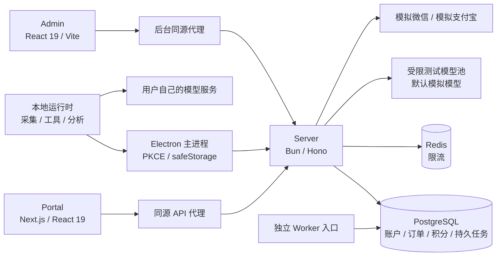
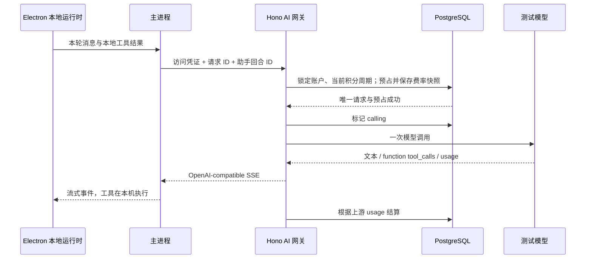

# 织云商业平台架构：AI 订阅与模拟支付

应用入口现为 `desktop`、`platform/portal`、`platform/admin`、`platform/server`。旧工作台和独立产品服务的移除见 [ADR 0011](../adr/0011-desktop-cloud-apps.md)，Electron 本地 `/api/v2` 保留。

版本：2026-09-10。本文与 [实施及验收计划](../product/zhiyun-cloud-implementation-plan.md) 共同描述本轮代码。商业服务面向中国大陆用户，采用月付、年付订阅；本轮交付可本地运行和容器化部署的测试平台，不进行公网生产部署。

## 1. 产品边界

| 能力                                                       | 执行位置                             | 是否需要云账户、订阅                           |
| ---------------------------------------------------------- | ------------------------------------ | ---------------------------------------------- |
| 网页采集、统计分析、语料处理、定时任务、导出、本地数据管理 | Electron 本地运行时及 Python Worker  | 不需要，免费                                   |
| 自带 API Key 的所有模型调用                                | 本地运行时直接调用用户配置的模型服务 | 不需要云账户或订阅；用户自行承担模型供应商费用 |
| 平台托管 AI                                                | 云端模型网关；工具执行仍在 Electron  | 需要在线账户、有效订阅、已激活设备和足够积分   |
| 官网、价格、下载、账户、订单、安全设置                     | Portal                               | 公共内容无需登录；个人资源必须登录             |
| 商品、模型、价格、积分、退款、运营审计                     | Admin + Server                       | 独立管理员身份与 TOTP                          |

**本地功能没有付费许可证检查。** 不签发能解锁采集、分析或导出的离线商业许可证。托管 AI 每次请求实时校验；账户缓存仅用于展示，不产生离线可消费积分。额度不足、订阅到期、设备撤销、网关不可用均不会自动调用用户的 Key。

云端可接收当前模型调用必要的消息、工具定义及本地工具结果。它不运行采集、文件访问、数据分析或助手工具。默认不把提示词、回答正文写入数据库或应用日志。

## 2. 总体结构



服务端是模块化单体，API 和 Worker 两个入口共享领域服务。没有另起账户、计费、网关等微服务。PostgreSQL 是持久事实来源；Redis 不存放权威余额、订单状态、订阅事实或唯一的任务记录。

### 仓库布局

```text
desktop/                   Electron 与本地 /api/v2；主进程云账户桥接
  analytics-worker/       Electron 本地 Python 分析与语料计算
  packages/               本地运行时、UI、客户端、业务插件与能力适配器
platform/
  portal/                  Next.js App Router，公共网站及用户中心
  admin/                   React 19 + Vite，独立后台
  server/
    src/app.ts             Hono 应用工厂和 OpenAPI 路由
    src/auth.ts            身份、会话、PKCE、MFA
    src/billing.ts         订单、模拟渠道、订阅、积分周期、退款
    src/ai.ts              模型准入、预占、流式转发、结算
    src/jobs.ts            PostgreSQL 持久任务与恢复
    src/start.ts           API 进程
    src/worker.ts          云端后台任务进程
    src/schema.ts          完整 Drizzle 表结构
    migrations/            经审阅的 SQL 迁移
    tests/                 Bun + 真实 PostgreSQL 集成测试
  packages/
    cloud-contracts/       Zod 输入、公开 DTO、OpenAPI 文件
    cloud-client/          OpenAPI 生成类型、公开 HTTP 客户端
    cloud-ui/              Tailwind v4、shadcn 风格基础组件、共享主题
  tooling/scripts/         契约生成、独立启动、隔离测试种子、备份恢复
  deploy/                  Docker、Compose、Caddy、环境示例
```

Web/Admin 共享基础 Button、Input、Card、Badge、Table、Field、Notice 和主题，不共享页面业务状态。组件使用 shadcn/ui 的 Radix Slot、CVA、`cn` 组合模式。Portal 维护个人会话和账户页面；Admin 维护独立的员工会话、筛选和运营表单。

## 3. 页面与部署入口

| 应用     | 页面                                                                                                                                                |
| -------- | --------------------------------------------------------------------------------------------------------------------------------------------------- |
| Portal   | `/`、`/pricing`、`/download`、`/docs`、`/changelog`、`/login`、`/checkout`                                                                          |
| 用户中心 | `/account`、`/account/subscription`、`/account/orders`、`/account/credits`、`/account/devices`、`/account/security`                                 |
| 桌面授权 | `/desktop/authorize`，显示授权目标并由登录用户明确授权                                                                                              |
| Admin    | 概览、用户、商品价格、托管模型费率、订阅、订单、退款、积分账本及周期、AI 请求核查、设备、自动续费协议、管理员、模拟工具、测试收件箱、后台任务、审计 |

开发默认 Portal `3100`、Admin `3101`、Server `3200`。E2E 独立使用 `3130 / 3131 / 3230`，避免与其他本地项目冲突。数据库和 Redis 仅映射至本地 `55432 / 56379`。

Portal 的同源代理只转发选定请求头，屏蔽 `/admin`；Next.js 不连接商业数据库。部署后的 Admin 静态站点由 Caddy 将后台 API 转发给 Hono。浏览器不获得数据库连接串、模型密钥、短信凭据或桌面刷新凭证。

个人页面动态渲染，API 返回 `private, no-store` 并按 Cookie/Authorization 区分。前端取得当前会话后才开放需要身份的按钮；SSR 尚未完成水合时表单不可提交，避免状态尚未初始化导致请求丢失。

下载地址使用 `NEXT_PUBLIC_DOWNLOAD_MAC / WINDOWS / LINUX` 构建配置。未提供发布地址时页面显示尚未发布，不伪造安装包链接。

## 4. 身份和会话

### 用户身份

- 中国大陆手机号验证码登录；邮箱密码登录。
- 邮箱注册/验证、密码重置、手机号或邮箱绑定均使用一次性挑战。
- 身份验证前不会绑定到现有用户，更不会根据相同邮箱或手机号自动合并账户。
- 挑战随机 6 位、10 分钟有效、最多 5 次尝试、每身份每小时最多 6 次签发。失败次数独立提交，不能因事务回滚清零。
- 验证码摘要、使用时间和尝试次数在 PostgreSQL；开发测试收件箱保存短期测试码，Worker 清理到期记录。
- 密码使用 Bun Argon2id；新密码最少 12 位；重置密码撤销原用户会话。
- 普通浏览器会话有效期 24 小时；会话令牌仅保存摘要，用户可撤销单个会话。
- 阿里云短信、SMTP 发送适配器默认关闭。真实凭据完全由服务器环境注入，未进行真实发送验收。

### 管理员

独立 `cloud_staff`、会话作用域与 `zy_staff` HttpOnly Cookie。用户 Cookie 不能访问后台。角色为 owner、support、finance、operator，服务器逐操作验证权限。

首次部署运行 `admin:create`，使用环境变量输入邮箱和初始密码，控制台仅输出一次 TOTP 注册 URI。后续员工由 owner 创建。登录必须同时校验密码及 TOTP；同一时间步验证码不能重放。MFA 种子使用 AES-256-GCM 加密，密钥来自 `CLOUD_MFA_KEY`。禁用员工会撤销员工会话。

浏览器写操作同时检查精确 Origin 和会话 CSRF token。匿名登录/验证码请求也检查 Origin。桌面 Bearer 必须对应有效会话；不能用任意 Authorization 值绕过 Origin 检查。

### Electron PKCE

1. 主进程生成随机 verifier、S256 challenge、state，监听随机 `127.0.0.1` 端口的 `/callback`。
2. 系统浏览器进入 Portal 授权页，用户登录后确认。
3. 服务端签发 2 分钟有效、一次性、绑定 redirect URI / challenge / 设备的授权码。
4. 主进程验证 state，再用 verifier 交换凭证；服务器只接受标准 loopback callback。
5. 访问令牌 15 分钟，刷新凭证 30 天，刷新时轮换；旧刷新凭证重放会撤销对应整个 family。
6. 凭证使用 Electron safeStorage 加密、原子落盘。Renderer IPC 只提供摘要、登录、退出、选择 AI 模式和打开用户中心。
7. 设备解绑立即撤销该设备的服务端访问。最多 2 台设备；不会限制本地或 BYOK 功能。

长期凭证不进入 Renderer、助手上下文、页面 localStorage、用户日志或 URL。运行时到主进程使用已有认证的本地 Host Capability 通道，不从主进程取出云端长期凭证。

## 5. 数据模型与约束

| 数据组     | 表及作用                                                                                                         |
| ---------- | ---------------------------------------------------------------------------------------------------------------- |
| 身份       | `cloud_users`、`cloud_identities`、`cloud_challenges`、`cloud_sessions`、`cloud_refresh_history`                 |
| 桌面       | `cloud_devices`、`cloud_desktop_codes`                                                                           |
| 后台身份   | `cloud_staff`，员工会话通过 `cloud_sessions.staff_id` 与用户会话隔离                                             |
| 商品与模型 | `cloud_prices`、`cloud_models`，每次变更创建新版本 UUID                                                          |
| 支付       | `cloud_orders`、`cloud_payment_attempts`、`cloud_payment_events`、`cloud_refunds`                                |
| 订阅       | `cloud_terms`、`cloud_agreements`                                                                                |
| 积分       | `cloud_credit_periods`、`cloud_credit_ledger`、`cloud_ai_requests`（含预占、费率快照、用量和结算状态）           |
| 运行       | `cloud_jobs`、`cloud_runtime_status`、`cloud_audit`、`cloud_rate_limits`、`cloud_test_inbox`、`cloud_migrations` |

关键数据库约束：

- 用户身份全局唯一；授权码、会话摘要、刷新凭证摘要唯一。
- 用户 + 订单业务键唯一；协议 + 账期唯一；支付事件业务键唯一。
- 一个用户、一个产品至多一个 pending/active/canceling 协议。
- 订单只对应一个服务期；服务期 + 积分开始时间唯一。
- AI 请求 ID 为主键；账本业务键唯一；余额、预占不得为负。
- 价格和模型 `config` 不可原地修改，数据库触发器要求创建新版本。
- 积分账本禁止 UPDATE/DELETE；更正通过带原因和审计的调整流水完成。
- 订单和 AI 请求带测试环境标记，不提供生产模型池消费路径。

Drizzle 保存完整关系结构，并用于公开目录查询。需要显式行锁、SKIP LOCKED、业务幂等的领域事务使用 PostgreSQL 参数化 SQL。Drizzle 和事务 SQL 使用各自连接池，避免 Drizzle 的时间编码映射影响原生事务的 Date 语义。迁移使用事务和 advisory lock，保证多个进程不会同时应用同一个迁移。

## 6. 商品、周期与积分规则

售价单位为人民币分，积分为整数。`cloud_prices.config` 快照保存名称、月/年周期、售价、每月积分和模型版本列表。模型版本保存上游模型、适配器、密钥环境变量引用、上下文/输出上限、每千输入/输出 Token 积分费率。

商品默认不存在/未发布，试用默认关闭。运营先创建模型并通过连接测试，再创建完整价格版本，最后发布测试商品。订单创建还会再次检查所有模型可用，模型停用后不能继续购买依赖该模型的商品。首版没有积分加购包、按比例升降级或自动补充当前额度。

### 日历服务期

按 Asia/Shanghai 民用时间保留原始订阅锚点。月付增加一个日历月，年付增加十二个日历月；月底取目标月最后一天，但保留原始锚点，避免 1 月 31 日 → 2 月末之后永久变成 28/29 日。服务期使用半开区间 `[starts_at, ends_at)`。

提前续费从最后一个未撤销的已付服务期末尾开始；月年切换同样进入下一个服务期。到期后重新购买从当前时间建立新锚点。重复成功事件不延长第二次。

年付创建十二个独立积分周期，到各周期开始才发放。Worker 不补发已经完全过去的月份；查询账户和预占积分也会补执行当前有效周期的同步。续费不会补充当前用尽的额度。

### 积分账本

账本 `amount` 表示可用积分的变化，不是支付金额：

| 事件            | 可用余额变化                    | 预占变化                    |
| --------------- | ------------------------------- | --------------------------- |
| grant           | +本月额度                       | 0                           |
| reserve         | -最大预占                       | +最大预占                   |
| settle          | +预占减实际费用                 | -最大预占                   |
| release         | +全部未消费预占（周期仍有效时） | -最大预占                   |
| expire / refund | -过期或退款的未消费余额         | 已发出的预占保留到结算/核查 |
| adjust          | 经审计的正/负调整               | 0                           |

结算释放的积分若已经过期或退款，会追加对应 expire/refund 流水，不重新成为可消费余额。历史用量、已经消费的积分和支付记录保留。

实际积分为 `ceil((input_tokens × inputRate + output_tokens × outputRate) / 1000)`，按请求预占时的模型版本计算。最大预占使用请求字节量及协议开销的保守输入上界、受限最大输出量。仅接收文本和本地函数工具格式，不接受任意远程工具类型或任意代理参数。

## 7. 模拟支付与自动续费

**所有收银台、价格提示和模拟工具均标注“模拟支付，不会实际扣款”。** 渠道只有 `mock-wechat`、`mock-alipay`，不加载真实支付 SDK，不调用真实支付或代扣接口。

模拟支付事实先写入支付尝试，再通过持久通知任务进入统一事件处理及履约事务。支持 success、failure、cancel、delay、duplicate、out-of-order、unknown。延迟为测试环境 60 秒；重复场景可重复通知，乱序场景先失败后成功；unknown 保留原支付标识，后台查询该支付事实，不创建第二次支付。

本地关单和实际成功通知竞态以已确认的渠道支付事实为准：关单后确认成功仍只履约一次。退款先创建 pending 退款申请，待模拟渠道确认后撤销相应服务期与未消费积分；未知退款先保留原权益，按持久任务查询确认。

自动续费协议先 pending、模拟签约后 active，取消后 canceled。每个协议、账期只有一个收费意图；工作进程重启复用原订单。渠道切换必须先确认旧协议结束。取消与扣款派发通过协议锁串行化；已创建的支付事实仍按原意图核查，取消不会抹除已经支付的服务期。

失败扣款不盲目创建下一张订单：保留该账期的原始意图，运营可以查询或对同一订单模拟最终确认。确认后才推进下一收费日期。测试通过可注入 Clock 推进月底、闰年、年付周期和恢复时间，不等待真实月份。

## 8. 托管 AI 网关



状态为 `reserved → calling → settled`；调用前取消可 `released`；无法确认上游结果或用量则 `review`。重复 ID 校验账户、请求指纹和回合，不重新调用。客户端上报用量不是扣积分来源。缺失、非法或超出预占的上游用量保留预占等待核查，不透支账户。

默认 mock 模型仅产生明确标注的测试响应。真实 OpenAI-compatible 联调必须使用独立测试上游、测试密钥和预算，并在 `CLOUD_MODEL_ORIGINS` 中显式允许 HTTPS origin。禁止重定向到其他上游，不接受请求自带的 base URL、密钥或模型池。

每账户最多 2 个进行中的调用、单次 90 秒上游期限、4 MiB 响应上限、512 KiB HTTP 请求上限、每模型上下文与输出上限，另有系统每日 Token 预算。活跃请求检查取消标记及设备撤销。服务端重启后超过恢复阈值的调用转入 review，禁止自动重发。

标准 OpenAI-compatible 接口没有通用的历史用量查询协议，所以 review 由运营核查。首版提供带审计原因的补偿释放，不伪造缺失 usage 或宣称自动查到了未知费用。完成态只保存标识、模型版本、用量、积分、时间和错误类别；重放返回结算状态，不保存正文以重放回答。

## 9. 后台任务、运行与恢复

`cloud_jobs` 是 PostgreSQL outbox/任务表。Worker 用 `FOR UPDATE SKIP LOCKED` 领取任务，保留锁期限、尝试次数、下次时间、错误类别；崩溃后任务重新可领取。领域处理必须幂等，任务重跑不重复发积分、履约、退款。

任务范围包括支付通知、超时查单、关单、退款确认、模拟周期扣款、积分开期/过期与 AI 不明请求转核查。失败任务指数退避，超过次数进入 failed，由 Admin 审查后重新排队。没有把模型提示词放进 outbox。

Redis 使用原子计数与过期做短期限流；故障时回退 PostgreSQL 限流记录。PostgreSQL 不可用时支付与 AI 请求失败关闭，不切到内存账本。`/health` 区分数据库可用和 Redis degraded，后台 metrics 提供 Worker 心跳、任务状态、请求状态及积分汇总。

备份使用 PostgreSQL `pg_dump -Fc`；恢复前停 API/Worker，使用显式恢复标志运行 `pg_restore`，然后迁移并核查待处理通知及 review 请求。账本和价格版本不得手工覆盖。详见 [本地运行与交付说明](../../platform/deploy/README.md)。

## 10. 接口与工程约束

本地 `/api/v2` 完整保留；云端统一 `/api/cloud/v1`。

| 接口组     | 主要能力                                                                                    |
| ---------- | ------------------------------------------------------------------------------------------- |
| auth、me   | 验证码、密码、绑定、重置、退出、账户、订阅、积分、用量、设备、会话                          |
| billing    | 模拟订单、自动续费签约申请、取消未来续费                                                    |
| simulation | 本人订单的模拟结果、签约确认；环境和所有权限制                                              |
| desktop    | PKCE 授权、一次性交换、刷新凭证轮换                                                         |
| ai         | 可用模型、OpenAI-compatible 完成/SSE、请求状态、取消                                        |
| admin      | 独立登录、MFA、角色、商品与模型发布、账本、退款、设备、人员、异常任务、模拟工具、审计和指标 |

Hono/Zod 路由导出 OpenAPI 3.1。公开输入及账户/订单/积分/请求响应在 `platform/packages/cloud-contracts`；`platform/packages/cloud-client/src/generated.ts` 由 OpenAPI 生成，CI 对照生成结果检查漂移。依赖检查禁止 Web/Admin 直接导入 Server、PostgreSQL 或本地工具实现，也禁止云端导入 Electron 或采集运行时。

本轮没有真实微信/支付宝支付、真实代扣、真实短信/邮件投递、真实模型计费、生产签名证书、公网部署验收。模拟通过只能证明本轮测试系统内的行为，不能替代这些外部联调。
